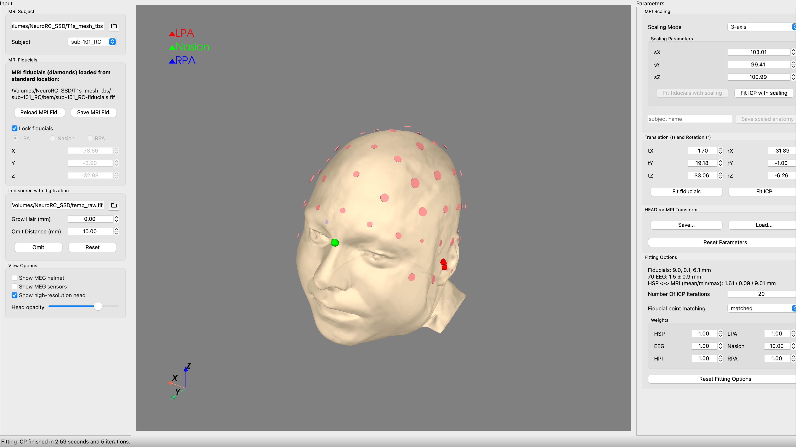
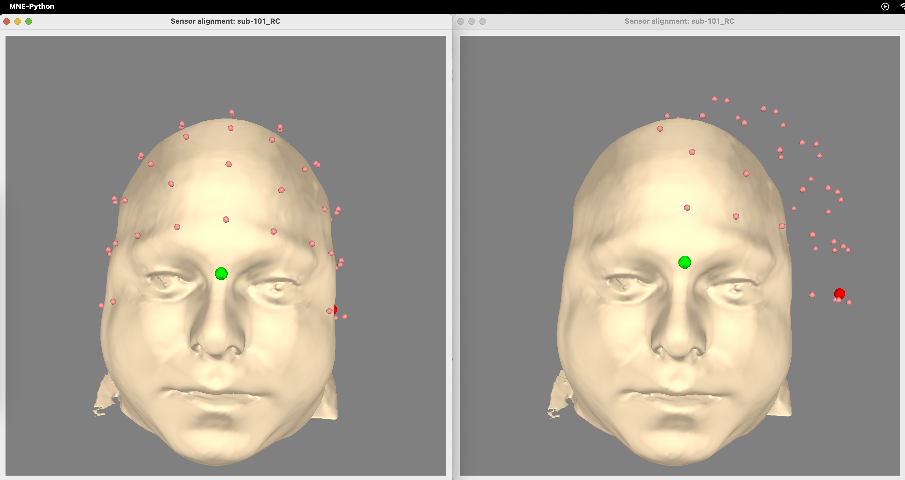
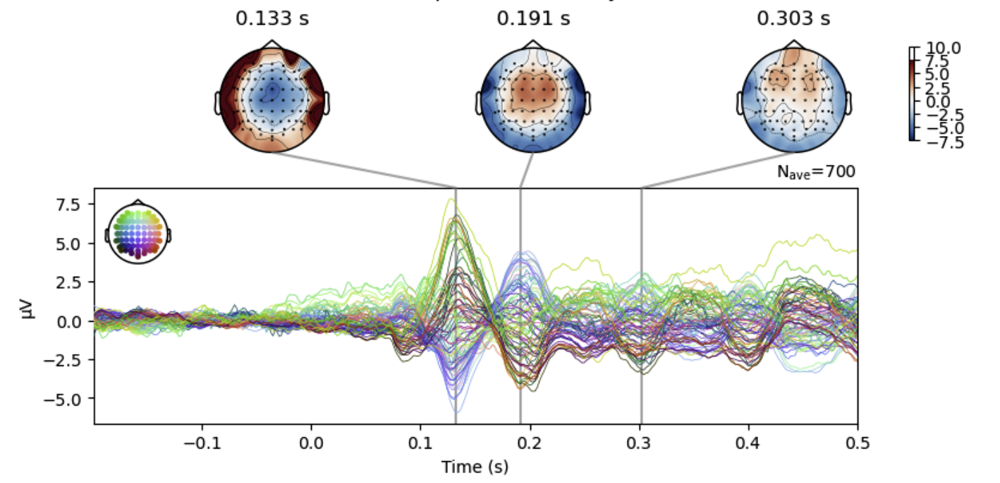
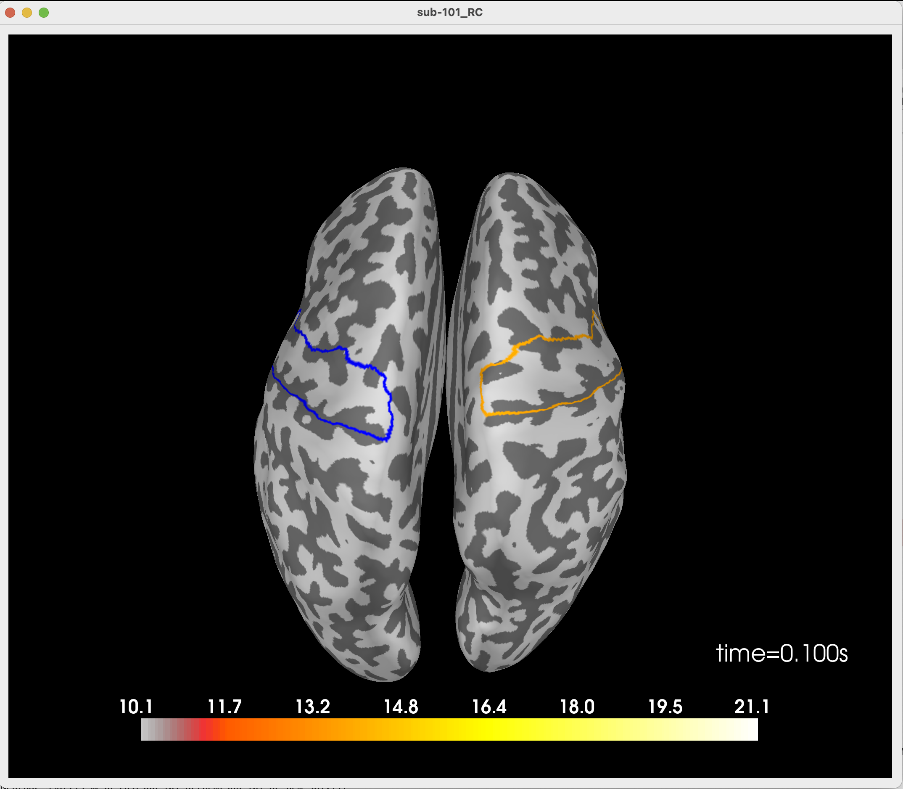

# EEG source localisation pipeline

Here, I provide a comprehensive pipeline for performing source localisation from EEG data, including preprocessing, epoching, source reconstruction, and visualisation of cortical activations. The pipeline integrates steps from raw EEG data handling to source localisation, leveraging Freesurfer and MNE-Python for anatomical and functional analysis. Here is an overview of the pipeline’s logical flow:

Main ingredients:

Digitisation: EEG digitisation involves recording electrode positions in 3D space relative to anatomical landmarks, such as nasion and preauricular points. Accurate digitisation ensures alignment between the electrode montage and the subject’s anatomy. In this pipeline, the standard 10-20 montage is used, with adjustments to exclude non-EEG channels (e.g., eye movement or stimulus channels). Proper alignment is super important for constructing accurate head models and source reconstructions.

Anatomical Reconstruction: Anatomical data is processed using Freesurfer to create subject-specific head models.Freesurfer generates a high-resolution segmentation of the brain, producing surface meshes of the cortex, scalp, and skull. These surfaces are stored as boundary element method or BEM models used for forward modelling. I think if you are here, you know that the recon-all command is a prerequisite for this pipeline, generating cortical parcellations, which serve as anatomical labels for extracting ROI time courses or even a full brain exploration.

  

Example of a decent coregistration and correct feducial coordinates

  

Examples of good and bad registrations (poor digitisation, or faulty/incorrect .sfp files)

EEG Preprocessing: Raw EEG data is preprocessed to handle missing or noisy channels, re-reference the signals to the average EEG reference, and apply baseline corrections. Non-EEG channels (e.g., eye or stimulus channels) are excluded or marked as bad, as they are unnecessary for source localization. The digitised electrode positions are aligned with the subject’s MRI coordinate system, ensuring accurate spatial correspondence.

  

Epoching and Event Extraction: At this stage, the pipeline identifies task-related events using the stimulus channel (e.g., "Status") and segments the EEG into epochs surrounding each event. Epoching ensures temporal alignment around the task of interest (e.g., a button press). Baseline correction is applied to ensure that pre-stimulus activity is centered, reducing the influence of non-task-related fluctuations. Epochs are then averaged to compute evoked responses.

Forward Model Construction: A forward model describes the relationship between neural sources and the measured EEG signals. Using the head model and electrode positions, the forward model computes the lead field matrix, which links cortical sources to scalp potentials. BEM is used for accurate head modelling (this way you levarage subject-specific anatomical surfaces).

Inverse Solution: The inverse problem estimates cortical sources from scalp EEG. Due to its underdetermined nature, constraints are applied, such as depth weighting and loose dipole orientations.
Here, I then use the dynamic statistical parametric mapping (dSPM) approach, which normalises source estimates relative to noise, enhancing the resolution of cortical activations.

Source Time Course and ROI Extraction: At this stage, cortical activation time courses are computed for all vertices in the source space. ROIs, such as the motor cortex, are defined using Freesurfer parcellations, and their mean activation time courses are extracted. This step enables region-specific analyses, such as identifying peak activations in the left and right hemispheres. But agin, if you wish to look at the entire brain, defining ROIs would be redundant. 

  

Visualisation and Results: Source activations are visualized on cortical surfaces, highlighting global and regional peaks. The time viewer provides an interactive way to explore temporal dynamics of activation across the cortex.
Peak activations are reported with MNI coordinates and vertex indices, which you can then use for further analyses or integration with other imaging analysis modalities.

  

